# SSUI Framework (SalesSync UI)

A lightweight, dependency-free CSS + JS component framework for integration-style dashboards and back-office tooling. SSUI ships a dark-first design system built around a brand green (`#3BBA7E`), a severity/status token palette, and a handful of interactive behaviours (tabs, modals, drawers, data tables, toasts, charts) that work from plain markup via `data-ss-*` attributes — or from any framework (React, Vue, vanilla) when you use the CSS on its own.

## At a glance

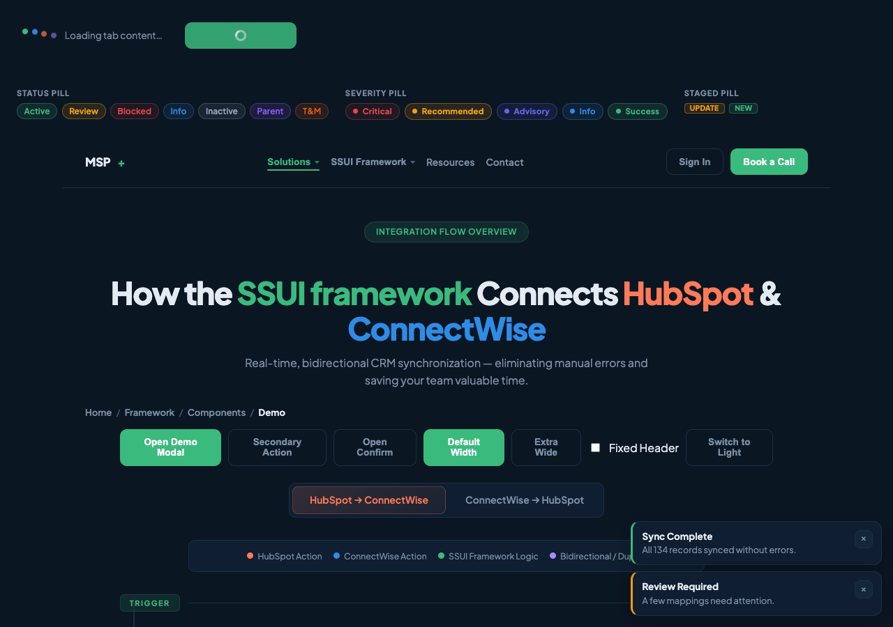

- **~580 lines of CSS** — all scoped under `.ss-ui` so nothing leaks into the rest of the page
- **~1860 lines of vanilla JS** — zero runtime dependencies, exposes `window.SSUI`
- **Two themes** — `tokens.css` (dark, default) and `tokens.light.css`, switchable at runtime via `SSUI.setTheme()`
- **Plus Jakarta Sans** typography, 8/10/12 px radius scale, one elevation shadow
- **Severity + tone token palette** wired into status pills, severity pills, staged pills, and alerts
- **Components:** header/nav, hero, breadcrumbs, flow diagram, cards, tabs, tables (sortable + fully-featured data table with bulk select, column toggles, pagination, server mode), forms (inputs, select, textarea, radio, check, transfer list, combobox, upload), drawer, modal, confirm, popover, tooltip, toast, alert, accordion, stepper, command palette, charts (bar, line, pie), gauge, progress bar, skeleton, empty state, loading spinner (ring + bouncing dots)

## Installation

SSUI is a **git submodule**. In a consumer repo:

```bash
git submodule add https://github.com/spg-craig/SSUI-Framework.git src/styles/ssui
git submodule update --init --recursive
```

Bump to latest:

```bash
git submodule update --remote src/styles/ssui
git add src/styles/ssui && git commit -m "Bump SSUI"
```

The submodule is intentionally public so platforms like Vercel can resolve it without extra credentials.

### Including the files

Order matters — tokens first, then components, then JS at the end of `<body>`:

```html
<link href="https://fonts.googleapis.com/css2?family=Plus+Jakarta+Sans:wght@400;600;700;800&display=swap" rel="stylesheet" />
<link rel="stylesheet" href="/styles/ssui/tokens.css" id="ss-theme-dark" />
<link rel="stylesheet" href="/styles/ssui/tokens.light.css" id="ss-theme-light" disabled />
<link rel="stylesheet" href="/styles/ssui/components.css" />

<body class="ss-ui">
  <!-- everything goes inside a .ss-ui root -->
  <script src="/styles/ssui/components.js"></script>
</body>
```

The `id="ss-theme-dark" | ss-theme-light` + `disabled` attributes are what `SSUI.setTheme()` toggles.

### The `.ss-ui` scope (important)

Every SSUI style is nested under `.ss-ui`. Nothing outside that root inherits typography, colours, or box-sizing resets. This is intentional so SSUI can coexist with a host app's own styles.

### Using SSUI with React / Next.js

In the MSP+ Planning App we load **only the CSS** and re-implement interactive behaviours in React. Running `components.js` alongside React causes virtual-DOM fights because SSUI's behaviours manipulate DOM directly.

```ts
// app/globals.css or layout import
import '@/styles/ssui/tokens.css'
import '@/styles/ssui/components.css'
// DO NOT import components.js
```

```tsx
<div className="ss-ui">
  <button className="ss-btn primary">Save</button>
  <span className="ss-status-pill is-ok">Active</span>
</div>
```

Behavioural parity (modals, drawers, toasts, sortable tables) lives in shared React primitives — see `src/components/ui/` in the Planning App (`LoadingButton`, `EditItemModal`, `ConfirmDialog`, `Toast`, `SortableTable`, `StagedBadge`, `SeverityBadge`, `FlagBadge`, `CategoryBadge`, `DiffPreview`).

## Theming

Two token files — same variable names, different values.

```js
SSUI.setTheme('light')   // flips the disabled stylesheets
SSUI.setTheme('dark')
SSUI.getTheme()          // 'dark' | 'light'
```

Theme choice is persisted to `localStorage` under `data-ss-theme`.


Customise any token by re-declaring it on `:root` **after** the SSUI tokens load:

```css
:root {
  --ss-green: #2ea776;
  --ss-bg: #000;
}
```

## Foundations

### Colour tokens

Defined in `tokens.css` (dark) and `tokens.light.css` (light). Both files expose the same variable names.

| Token | Purpose |
|---|---|
| `--ss-green` `#3BBA7E` | Brand accent, primary buttons, success |
| `--ss-hs` `#FF7A59` | HubSpot accent |
| `--ss-cw` `#2E8CE6` | ConnectWise accent |
| `--ss-duplex` `#A78BFA` | Bidirectional / tertiary accent |
| `--ss-bg` / `--ss-surface` / `--ss-surface2` / `--ss-surface3` | Background + elevation ladder |
| `--ss-text` / `--ss-text-dim` | Primary + secondary copy |
| `--ss-border` / `--ss-border-light` | Default + hairline borders |

### Severity palette

Each severity has a triplet: solid colour, translucent background, matching border.

| Class on `.ss-severity-pill` | Token |
|---|---|
| `.is-critical` | `--ss-critical`, `--ss-critical-bg`, `--ss-critical-border` |
| `.is-recommended` | `--ss-warn`, `--ss-warn-bg`, `--ss-warn-border` |
| `.is-advisory` | `--ss-advisory`, `--ss-advisory-bg`, `--ss-advisory-border` |
| `.is-info` | `--ss-info`, `--ss-info-bg`, `--ss-info-border` |
| `.is-success` | `--ss-success`, `--ss-success-bg`, `--ss-success-border` |
| — (neutral) | `--ss-neutral`, `--ss-neutral-bg`, `--ss-neutral-border` |
| — (tone) | `--ss-tone-purple{,-bg,-border}`, `--ss-tone-orange{,-bg,-border}` |

Consumers should reference these tokens rather than hardcoding `rgba(...)`. Light and dark themes swap the hex values automatically.

### Typography, spacing, radius, shadow

- **Font:** Plus Jakarta Sans (400 / 600 / 700 / 800)
- **Radius:** `--ss-r-8` `8px`, `--ss-r-10` `10px`, `--ss-r-12` `12px`
- **Shadow:** `--ss-shadow-1` (single elevation level)
- **Layout max width:** `--ss-layout-max` (1100px default, 1440px when `.ss-ui` has `.ss-layout-xwide`)

---

## Layout components

### Header + Nav


```html
<header class="ss-header">
  <div class="ss-brand">MSP<span class="plus">+</span></div>
  <nav class="ss-nav">
    <div class="ss-nav-group">
      <button class="ss-nav-label" type="button" data-ss-nav-toggle aria-expanded="false">
        Solutions <span class="ss-nav-caret">▾</span>
      </button>
      <div class="ss-nav-sub">
        <a href="#">CRM Sync</a>
        <a href="#">Data Mapping</a>
      </div>
    </div>
    <a href="#">Resources</a>
  </nav>
  <div class="ss-cta">
    <button class="ss-btn ghost">Sign In</button>
    <button class="ss-btn primary">Book a Call</button>
  </div>
</header>
```

- `data-ss-nav-toggle` opens/closes a `.ss-nav-sub` dropdown.
- Add `.is-fixed` (or call `SSUI.setHeaderFixed(headerEl, true)`) to make the header sticky.

### Breadcrumbs


```html
<nav class="ss-breadcrumbs" aria-label="Breadcrumb">
  <a href="#">Home</a><span class="ss-breadcrumb-sep">/</span>
  <a href="#">Framework</a><span class="ss-breadcrumb-sep">/</span>
  <span class="is-current" aria-current="page">Demo</span>
</nav>
```

### Hero


```html
<div class="ss-hero">
  <div class="badge">Integration Flow Overview</div>
  <h1>Big fluid headline</h1>
  <p>Sub-copy up to ~600px wide.</p>
</div>
```

### Container + layout primitives

- `.ss-container` — max-width centred wrapper
- `.ss-section` — vertical padding block
- `.ss-section-title` — heading + lede pair
- `.ss-stack` — vertical flow; `--ss-stack-gap` sets gap
- `.ss-cluster` — horizontal wrap with gap
- `.ss-grid.ss-grid-2` / `.ss-grid-3` — quick columns; `--ss-grid-gap` sets gap
- `.ss-surface-card` — elevated card surface for content blocks
- `.ss-ui.ss-layout-xwide` — widen max content width

### Tabs

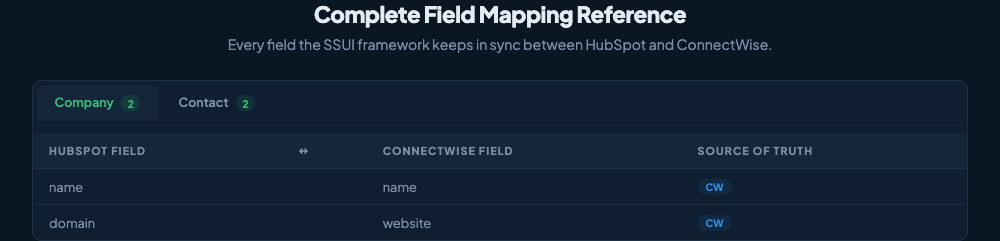

```html
<div class="ss-tabs">
  <div class="ss-tabs-header">
    <h2>Field Mapping</h2>
    <p>Every field the SSUI framework keeps in sync.</p>
  </div>
  <div class="ss-tab-bar">
    <button class="active" data-ss-tab="company">Company <span class="count">2</span></button>
    <button data-ss-tab="contact">Contact <span class="count">2</span></button>
  </div>
  <div id="ss-tab-company" class="ss-tab-panel active">…</div>
  <div id="ss-tab-contact" class="ss-tab-panel">…</div>
</div>
```

Panel id must be `ss-tab-{value}`.

### Drawer

Right-side panel for focused secondary tasks.


```html
<button class="ss-btn primary" data-ss-drawer-open="ss-demo-drawer">Open Drawer</button>

<div class="ss-drawer" id="ss-demo-drawer" aria-hidden="true">
  <div class="ss-drawer-backdrop"></div>
  <aside class="ss-drawer-panel" role="dialog" aria-modal="true">
    <div class="ss-drawer-head">…<button data-ss-drawer-close>×</button></div>
    <div class="ss-drawer-body">…</div>
    <div class="ss-drawer-foot">…</div>
  </aside>
</div>
```

JS: `SSUI.openDrawer(id)` / `SSUI.closeDrawer(id)`.

### Modal + confirm

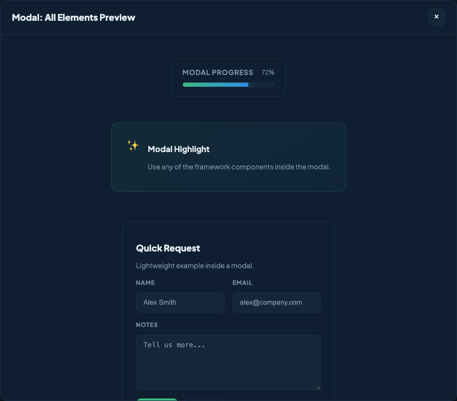

```html
<button data-ss-modal-open="ss-demo-modal" data-ss-modal-template="ss-demo-modal-template">Open</button>

<template id="ss-demo-modal-template">
  <div class="ss-modal" id="ss-demo-modal" aria-hidden="true">
    <div class="ss-modal-backdrop" data-ss-modal-close></div>
    <div class="ss-modal-panel" role="dialog" aria-modal="true">
      <div class="ss-modal-head">
        <div class="ss-modal-title">Title</div>
        <button class="ss-modal-close" data-ss-modal-close>×</button>
      </div>
      <div class="ss-modal-body">…</div>
      <div class="ss-modal-footer">…</div>
    </div>
  </div>
</template>
```

Confirm dialog (promise-based):

```js
const ok = await SSUI.confirm({
  title: 'Continue Sync Run?',
  message: 'This will trigger a full sync job.',
  confirmLabel: 'Continue',
  cancelLabel: 'Deny'
})
```

### Popover + Tooltip

```html
<div class="ss-popover-wrap">
  <button data-ss-popover-toggle="ss-demo-popover">Toggle</button>
  <div class="ss-popover" id="ss-demo-popover">…</div>
</div>

<span class="ss-tooltip" data-ss-tooltip="Sync starts every 15 minutes">
  <button class="ss-btn ghost">Target</button>
</span>
```

### Command palette

```html
<button data-ss-command-open>Open</button>

<div class="ss-command" id="ss-command" aria-hidden="true">
  <div class="ss-command-backdrop"></div>
  <div class="ss-command-panel">
    <input class="ss-input" data-ss-command-input placeholder="Type a command..." />
    <div class="ss-command-list">
      <button class="ss-command-item" data-ss-command-item="Run Sync">Run Sync</button>
    </div>
  </div>
</div>
```

Opens on `Cmd/Ctrl + K` or via `SSUI.openCommandPalette()`.

---

## Data display

### Buttons


```html
<button class="ss-btn primary">Primary</button>
<button class="ss-btn ghost">Secondary</button>
<button class="ss-btn primary is-loading">Saving…</button>   <!-- ring spinner -->
<button class="ss-icon-btn" aria-label="Edit">✎</button>
<button class="ss-icon-btn is-danger" aria-label="Delete">🗑</button>
```

- `.ss-btn.primary` — brand green, solid
- `.ss-btn.ghost` — transparent with border
- `.ss-btn.is-loading` — hides label, shows rotating ring via `ss-spin` keyframe
- `SSUI.setButtonLoading(btn, true)` — helper that toggles `.is-loading` and swaps the label

### Cards

`.ss-card` is the flow-diagram / node-body card. `.ss-surface-card` is a generic elevated content card. `.ss-form-card` is the wrapper used inside `.ss-form`.

### Flow diagram (SSUI signature component)

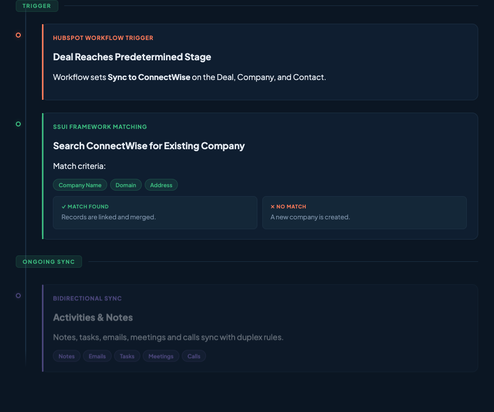


```html
<div class="ss-flow-toggle">
  <button data-ss-flow="hs" class="active-hs">HubSpot → ConnectWise</button>
  <button data-ss-flow="cw">ConnectWise → HubSpot</button>
</div>

<div class="ss-canvas">
  <div id="ss-flow-hs" class="ss-flow visible">
    <div class="ss-spine">
      <div class="ss-divider"><span>Trigger</span></div>
      <div class="ss-node hs">
        <div class="dot"></div>
        <div class="ss-card">
          <div class="ss-label">HubSpot Workflow Trigger</div>
          <h3>Deal Reaches Predetermined Stage</h3>
          <p>Body copy.</p>
          <div class="ss-pills">
            <span class="ss-pill green">Company Name</span>
          </div>
          <div class="ss-branch">
            <div class="ss-branch-option">
              <span class="tag ss-tag-match">✓ Match</span> …
            </div>
          </div>
        </div>
      </div>
    </div>
  </div>
</div>
```

Node tone classes: `.ss-node.hs`, `.cw`, `.sync`, `.duplex`. Pill tone classes on `.ss-pill`: `.green`, `.blue`, `.purple`.

### Legend


```html
<div class="ss-legend">
  <div class="ss-legend-item"><div class="ss-legend-dot hs"></div>HubSpot Action</div>
  <div class="ss-legend-item"><div class="ss-legend-dot cw"></div>ConnectWise Action</div>
  <div class="ss-legend-item"><div class="ss-legend-dot sync"></div>SSUI Logic</div>
  <div class="ss-legend-item"><div class="ss-legend-dot duplex"></div>Bidirectional</div>
</div>
```

### Stat tiles + highlight


```html
<div class="ss-stats"><div class="ss-stats-inner">
  <div class="ss-stat"><div class="num">65+</div><div class="desc">Field Mappings</div></div>
  <div class="ss-stat"><div class="num purple">14</div><div class="desc">Deal Fields</div></div>
</div></div>

<div class="ss-highlight"><div class="ss-highlight-inner">
  <div class="icon">💼</div>
  <div><h3>Heading</h3><p>Body</p></div>
</div></div>
```

### Tables

Two variants:

**Simple `ss-table`** — classic bordered rows (inside `.ss-tab-panel`, used for reference content).

**`ss-table-fixed` with `[data-ss-data-table]`** — sortable, paginated, searchable, bulk-select, column toggles.

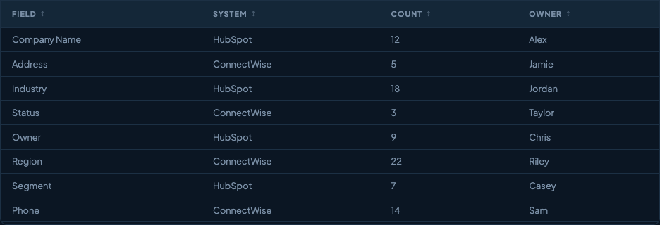
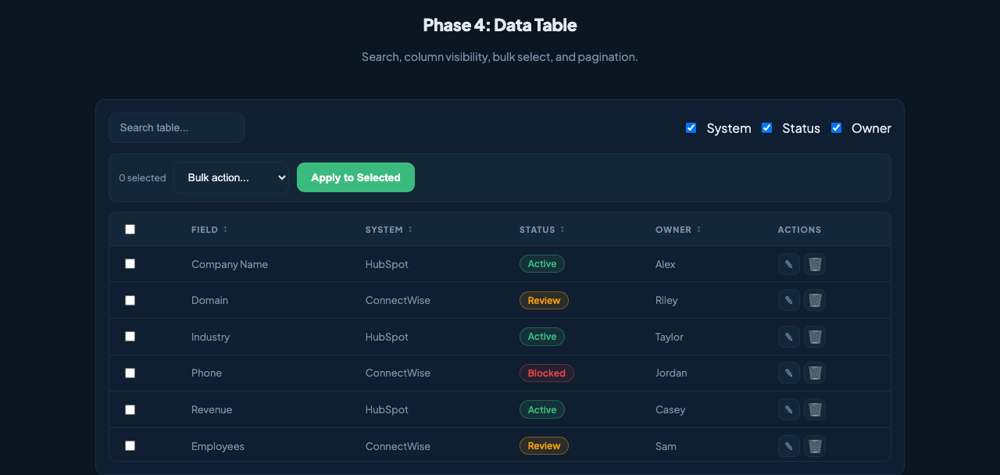

```html
<div class="ss-surface-card" data-ss-data-table>
  <div class="ss-data-table-tools">
    <input class="ss-input" data-ss-data-table-search placeholder="Search..." />
    <div class="ss-col-toggles">
      <label class="ss-check-inline"><input type="checkbox" data-ss-col-toggle="system" checked /> System</label>
    </div>
  </div>
  <div class="ss-data-table-bulk">
    <span class="ss-help" data-ss-bulk-count>0 selected</span>
    <select class="ss-select" data-ss-bulk-action>
      <option value="">Bulk action...</option>
      <option value="delete">Delete Rows</option>
    </select>
    <button class="ss-btn primary" data-ss-bulk-apply disabled>Apply</button>
  </div>
  <div class="ss-table-wrap">
    <table class="ss-table-fixed">
      <thead>
        <tr>
          <th><input type="checkbox" data-ss-select-all /></th>
          <th data-ss-sort="text">Field</th>
          <th data-ss-col="system" data-ss-sort="text">System</th>
        </tr>
      </thead>
      <tbody>
        <tr data-ss-row-id="row-1">
          <td><input type="checkbox" data-ss-row-select /></td>
          <td>Company Name</td>
          <td data-ss-col="system">HubSpot</td>
        </tr>
      </tbody>
    </table>
  </div>
  <div class="ss-data-table-actions">
    <button class="ss-btn ghost" data-ss-page-prev>‹</button>
    <button class="ss-btn ghost" data-ss-page-next>›</button>
    <select class="ss-select" data-ss-page-size>
      <option value="20" selected>20 / page</option>
    </select>
    <span class="ss-help" data-ss-page-info>Page 1/1</span>
  </div>
</div>
```

Row-level behaviours on `<tr data-ss-row>`:

- `data-ss-row-action="modal"` + `data-ss-row-value="modal-id"` — click opens that modal
- `data-ss-row-action="navigate"` + `data-ss-row-value="/path"` — client nav
- `data-ss-row-action="custom"` — fires `SSUI.onRowAction({row, action, value})`

Server mode:

```js
SSUI.setDataTableMode(wrap, 'server')
SSUI.setDataTableServerProvider(wrap, async (params) => {
  const res = await fetch('/api/rows?' + new URLSearchParams(params))
  return res.json()   // { rows: [...], total: 123 }
})
SSUI.refreshDataTable(wrap)
```

### Status pill / severity pill / staged pill

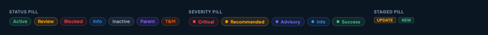

```html
<!-- Status pill — general purpose -->
<span class="ss-status-pill is-ok">Active</span>
<span class="ss-status-pill is-warn">Review</span>
<span class="ss-status-pill is-danger">Blocked</span>
<span class="ss-status-pill is-info">Info</span>
<span class="ss-status-pill is-neutral">Inactive</span>
<span class="ss-status-pill is-purple">Parent</span>
<span class="ss-status-pill is-orange">T&amp;M</span>

<!-- Severity pill — audit results only -->
<span class="ss-severity-pill is-critical">critical</span>
<span class="ss-severity-pill is-recommended">recommended</span>
<span class="ss-severity-pill is-advisory">advisory</span>
<span class="ss-severity-pill is-info">info</span>
<span class="ss-severity-pill is-success">success</span>

<!-- Staged pill — pending-change row indicator -->
<span class="ss-staged-pill is-update">Update</span>
<span class="ss-staged-pill is-new">New</span>
```

Aliases supported on `.ss-status-pill`: `.is-ok = .is-success`, `.is-warn = .is-recommended = .is-amber`, `.is-danger = .is-critical`, `.is-info = .is-advisory = .is-blue`.

### Progress bar


```html
<!-- animated marquee -->
<div class="ss-progress is-animated">
  <div class="ss-progress-card">
    <div class="ss-progress-head">
      <div class="ss-progress-title">Sync Progress</div>
      <div class="ss-progress-meta">Live update</div>
    </div>
    <div class="ss-progress-track">
      <div class="ss-progress-glow"></div>
      <div class="ss-progress-bar"></div>
    </div>
  </div>
</div>

<!-- static, controlled value -->
<div class="ss-progress is-static" style="--ss-progress:45%">…</div>
```

Update value: `SSUI.setProgress(el, 68)`.

## Form components

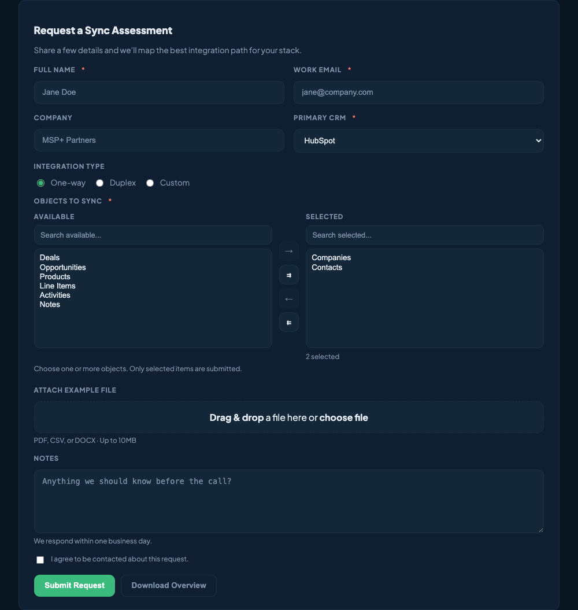

Skeleton:

```html
<form class="ss-form" data-ss-form data-ss-endpoint="/api/demo">
  <div class="ss-form-card">
    <div class="ss-form-head">
      <h3>Request</h3><p>Helper text.</p>
    </div>
    <div class="ss-form-grid">
      <div class="ss-field">
        <label class="ss-label" for="ss-name">Full Name<span class="ss-required">*</span></label>
        <input class="ss-input" id="ss-name" name="full_name" data-ss-required />
      </div>
      <div class="ss-field">
        <label class="ss-label" for="ss-email">Email</label>
        <input class="ss-input" id="ss-email" type="email" data-ss-required data-ss-validate="email" />
      </div>
      <div class="ss-field">
        <label class="ss-label" for="ss-system">CRM</label>
        <select class="ss-select" id="ss-system" data-ss-required>
          <option>HubSpot</option><option>ConnectWise</option>
        </select>
      </div>
      <div class="ss-field" style="grid-column:1/-1">
        <label class="ss-label">Integration Type</label>
        <div class="ss-radio-group">
          <label class="ss-radio"><input type="radio" name="integration" checked /> One-way</label>
          <label class="ss-radio"><input type="radio" name="integration" /> Duplex</label>
        </div>
      </div>
      <div class="ss-field">
        <label class="ss-label" for="ss-notes">Notes</label>
        <textarea class="ss-textarea" id="ss-notes"></textarea>
        <div class="ss-help">Optional context.</div>
      </div>
      <div class="ss-field">
        <label class="ss-check" for="ss-consent">
          <input id="ss-consent" type="checkbox" data-ss-required />
          <span class="ss-help">I agree to be contacted.</span>
        </label>
      </div>
    </div>
    <div class="ss-actions">
      <button class="ss-btn primary" type="submit">Submit</button>
    </div>
  </div>
</form>
```

Validation attributes:

- `data-ss-required` — required field
- `data-ss-validate="email"` — email format check
- Errors render as `.ss-field-error` under the field; invalid fields get `.ss-error`

Built-in specialised inputs (see demo.html for full markup):

- **Transfer list** — `[data-ss-transfer]` with source/selected selects. `SSUI.getTransferValues(wrap)` / `setTransferValues(wrap, values)`
- **Combobox / tag input** — `[data-ss-combobox]`, suggestions via `data-ss-combobox-options="a,b,c"`
- **File upload** — `.ss-upload > .ss-upload-drop > .ss-upload-input`
- **Date/time** — plain `input[type=date|time]` styled by `.ss-input`

### Inline checkboxes and radios

```html
<label class="ss-check-inline"><input type="checkbox" /> Enable</label>
<div class="ss-radio-group">
  <label class="ss-radio"><input type="radio" name="x" /> A</label>
</div>
```

---

## Feedback components

### Alerts

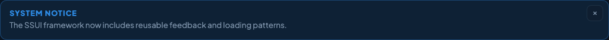

```html
<div class="ss-alert is-info" role="status">
  <div class="ss-alert-title">System Notice</div>
  <div class="ss-alert-text">Message body.</div>
  <button class="ss-alert-close" data-ss-alert-close aria-label="Dismiss">×</button>
</div>
```

Variants: `.is-info`, `.is-success`, `.is-warn`, `.is-error`. Update with `SSUI.setAlert(el, {type, title, text, visible})`.

### Toasts

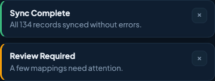

```js
SSUI.showToast({ type: 'success', title: 'Saved', text: '134 records updated', duration: 3200 })
SSUI.clearToasts()
```

Types: `success`, `info`, `warn`, `error`. A viewport `.ss-toast-viewport` is auto-created on first call.

### Loading states


Two distinct animations — **use the right one for the context**:

- **Buttons** → rotating ring (`.ss-btn.is-loading`, `ss-spin` keyframe). Toggle via `SSUI.setButtonLoading(btn, true)`.
- **Tab / section / page waits** → bouncing dots (`.ss-wait > .ss-wait-dots > .ss-wait-dot × 4`, `ss-chase` keyframe).

```html
<button class="ss-btn primary is-loading">Saving</button>

<span class="ss-wait"><span class="ss-wait-dots">
  <span class="ss-wait-dot"></span><span class="ss-wait-dot"></span>
  <span class="ss-wait-dot"></span><span class="ss-wait-dot"></span>
</span></span>
```

### Empty state + skeleton

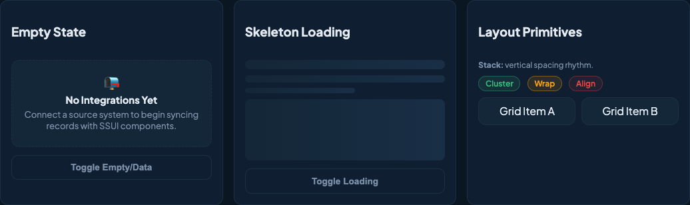

```html
<div class="ss-empty">
  <div class="ss-empty-icon">📭</div>
  <div class="ss-empty-title">No Integrations Yet</div>
  <div class="ss-empty-text">Connect a source system to begin syncing.</div>
</div>

<div class="ss-skeleton-wrap" data-ss-loading="true">
  <div class="ss-skeleton line lg"></div>
  <div class="ss-skeleton line"></div>
  <div class="ss-skeleton block"></div>
  <div data-ss-loaded>Real content (hidden while loading).</div>
</div>
```

Toggle via `SSUI.setEmptyState(wrap, isEmpty)` and `SSUI.setSkeletonLoading(wrap, isLoading)`.

---

## Accordion

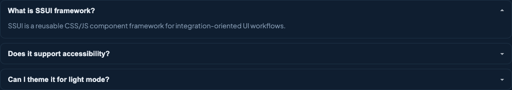

```html
<div class="ss-accordion" data-ss-accordion="single">
  <div class="ss-accordion-item is-open">
    <button class="ss-accordion-trigger" data-ss-accordion-trigger>
      Question <span class="ss-accordion-caret">▾</span>
    </button>
    <div class="ss-accordion-panel" data-ss-accordion-panel>Answer body.</div>
  </div>
</div>
```

`data-ss-accordion="single"` closes siblings on open. Omit for multi-open.

## Stepper / wizard

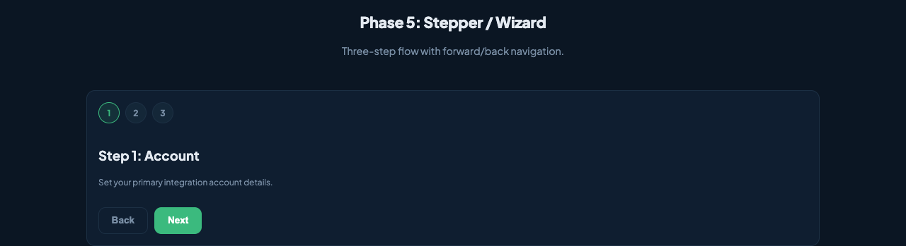

```html
<div class="ss-stepper" data-ss-stepper data-ss-step-index="0">
  <div class="ss-stepper-dots">
    <span class="ss-step-dot" data-ss-step-dot>1</span>
    <span class="ss-step-dot" data-ss-step-dot>2</span>
    <span class="ss-step-dot" data-ss-step-dot>3</span>
  </div>
  <div class="ss-step is-active" data-ss-step>…</div>
  <div class="ss-step" data-ss-step>…</div>
  <div class="ss-step-actions">
    <button class="ss-btn ghost" data-ss-step-back>Back</button>
    <button class="ss-btn primary" data-ss-step-next>Next</button>
  </div>
</div>
```

## Charts and gauges

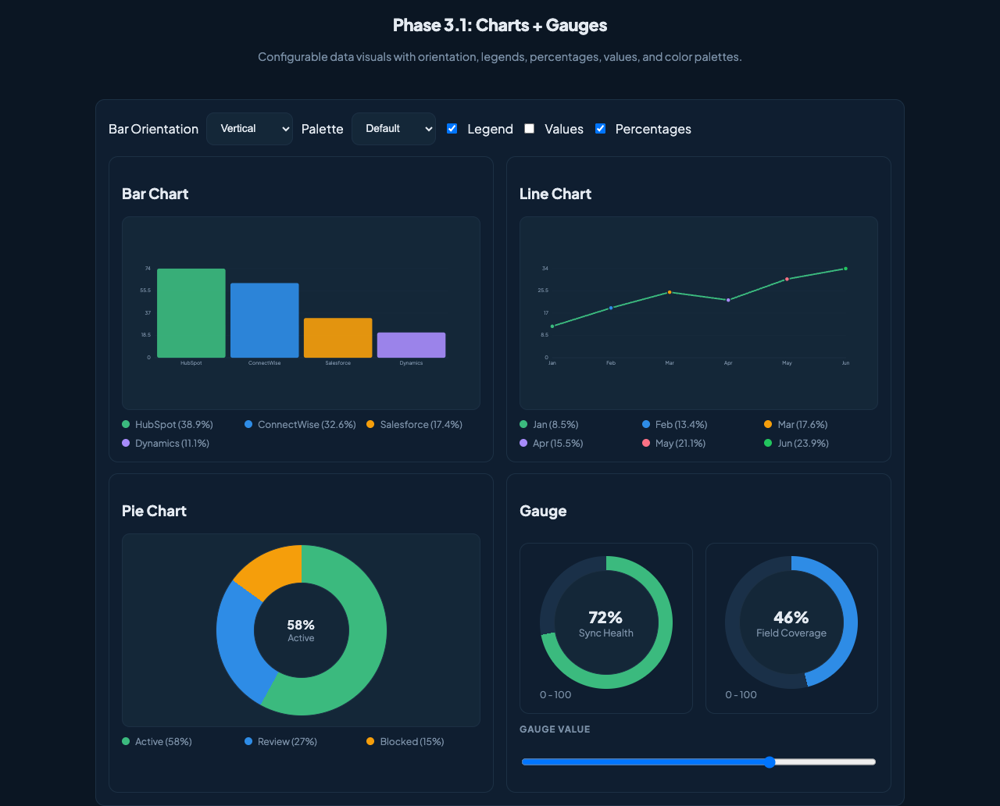

```html
<div data-ss-chart="bar"
     data-ss-values="HubSpot:74,ConnectWise:62,Salesforce:33"
     data-ss-colors="#3bba7e,#2e8ce6,#f59e0b"
     data-ss-orientation="vertical"
     data-ss-show-legend="true"
     data-ss-show-values="false"
     data-ss-show-percent="false"></div>

<div data-ss-chart="line" data-ss-values="Jan:12,Feb:19,Mar:25"></div>

<div data-ss-chart="pie" data-ss-values="Active:58,Review:27,Blocked:15"
     data-ss-show-values="true" data-ss-show-percent="true"></div>

<div data-ss-gauge data-ss-value="72" data-ss-label="Sync Health"
     data-ss-color="var(--ss-green)" data-ss-text="72%"></div>
```

Update at runtime: `SSUI.updateChart(el, {orientation, colors, showLegend, showValues, showPercent, values})` and `SSUI.updateGauge(el, {value, text, color, label})`. Re-scan the DOM with `SSUI.renderCharts(scope)`.

## Date / combobox

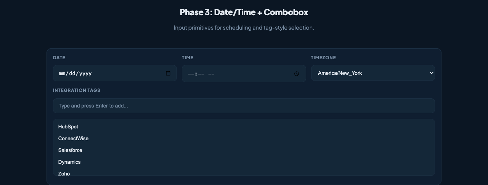

Styling only — the combobox adds suggestion + tag behaviour via `data-ss-combobox` (see demo.html lines 564–570).

---

## JS API reference

All functions live on `window.SSUI`.

### Theming & layout

| API | Purpose |
|---|---|
| `SSUI.setTheme('dark'\|'light')` | Switch token stylesheets; persists to `localStorage` |
| `SSUI.getTheme()` | Returns current theme |
| `SSUI.setHeaderFixed(headerEl, bool)` | Toggles sticky header |

### Buttons, progress, alerts, toasts

| API | Purpose |
|---|---|
| `SSUI.setButtonLoading(btn, bool, label?)` | Show/hide ring spinner on a button |
| `SSUI.setProgress(el, 0-100)` | Update static progress bar value |
| `SSUI.setAlert(el, {type,title,text,visible})` | Mutate an `.ss-alert` |
| `SSUI.showToast({type,title,text,duration?})` | Push a toast |
| `SSUI.clearToasts()` | Dismiss all |

### Empty / skeleton / transfer

| API | Purpose |
|---|---|
| `SSUI.setEmptyState(wrap, isEmpty)` | Swap empty ↔ data views |
| `SSUI.setSkeletonLoading(wrap, isLoading)` | Toggle skeleton ↔ real content |
| `SSUI.getTransferValues(wrap)` / `setTransferValues(wrap, values)` | Transfer list control |

### Overlays

| API | Purpose |
|---|---|
| `SSUI.openDrawer(id)` / `closeDrawer(id)` | Drawer panel |
| `SSUI.openCommandPalette()` / `closeCommandPalette()` | Cmd palette |
| `SSUI.confirm({title,message,confirmLabel?,cancelLabel?,confirmChoice?,cancelChoice?})` | Returns `Promise<boolean>` |

### Data table

| API | Purpose |
|---|---|
| `SSUI.setDataTableMode(wrap, 'client'\|'server')` | Switch sort/filter/page source |
| `SSUI.setDataTableServerProvider(wrap, fn)` | Server fetch callback `(params)=>{rows,total}` |
| `SSUI.refreshDataTable(wrap)` | Re-render |
| `SSUI.getDataTableParams(wrap)` | Current `{search, sort, page, pageSize, colVisibility}` |
| `SSUI.getTableSelectedRows(wrap)` | Array of selected `data-ss-row-id` |

### Charts

| API | Purpose |
|---|---|
| `SSUI.renderCharts(scope?)` | Scan the DOM and render any `[data-ss-chart]` / `[data-ss-gauge]` |
| `SSUI.updateChart(el, opts)` | Mutate a rendered chart |
| `SSUI.updateGauge(el, opts)` | Mutate a gauge |

### Networking

| API | Purpose |
|---|---|
| `SSUI.ajax(url, options?)` | Thin fetch wrapper returning parsed JSON |

### Event hooks (assign functions)

```js
SSUI.onRowAction = ({row, action, value}) => { … }
SSUI.onTableRowAction = ({action, rowId}) => { … }
SSUI.onTableBulkAction = ({action, rowIds}) => { … }
SSUI.onFormSuccess = (form) => { … }
SSUI.onFormError   = (form, err) => { … }
SSUI.onDataTableError = (err) => { … }
```

### `data-ss-*` attribute cheat sheet

| Attribute | Where | Purpose |
|---|---|---|
| `data-ss-theme="dark\|light"` | `<html>` | Set by `setTheme`; read at boot |
| `data-ss-nav-toggle` | nav button | Opens its `.ss-nav-sub` sibling |
| `data-ss-tab="x"` | tab button | Activates panel `#ss-tab-x` |
| `data-ss-modal-open="id"` + `data-ss-modal-template="templateId"` | button | Clone template → open |
| `data-ss-modal-close` | inside modal | Close |
| `data-ss-drawer-open="id"` / `data-ss-drawer-close` | button | Drawer control |
| `data-ss-popover-toggle="id"` | button | Toggle popover |
| `data-ss-tooltip="text"` | wrapper span | Pure CSS tooltip |
| `data-ss-confirm-modal` / `data-ss-confirm-choice` | confirm dialog | Internal wiring for `SSUI.confirm` |
| `data-ss-accordion="single"` / `data-ss-accordion-trigger` / `data-ss-accordion-panel` | accordion | Disclosure pattern |
| `data-ss-stepper` / `data-ss-step` / `data-ss-step-dot` / `data-ss-step-next` / `data-ss-step-back` / `data-ss-step-index` | stepper | Wizard flow |
| `data-ss-command-open` / `data-ss-command-close` / `data-ss-command-input` / `data-ss-command-item="label"` | command palette | Cmd/Ctrl+K palette |
| `data-ss-flow="hs\|cw"` | flow toggle button | Shows `#ss-flow-hs` / `#ss-flow-cw` |
| `data-ss-form` / `data-ss-endpoint="/api/…"` / `data-ss-required` / `data-ss-validate="email"` / `data-ss-native-validate` / `data-ss-no-submit-loading` / `data-ss-allow-enter-submit` | forms | Validation + async submit |
| `data-ss-alert-close` | alert × | Dismiss |
| `data-ss-toast-close` | toast × | Dismiss |
| `data-ss-empty` / `data-ss-items` | empty-state wrapper | Toggle empty ↔ list |
| `data-ss-loading` / `data-ss-loaded` | skeleton wrap | Toggle skeleton ↔ content |
| `data-ss-transfer` / `-source` / `-selected` / `-action` / `-filter` / `-count` | transfer list | Two-pane selector |
| `data-ss-combobox` / `-input` / `-list` / `-tags` / `-hidden` / `-option` / `-options` / `-name` / `-tag-remove` | combobox | Tag input with suggestions |
| `data-ss-data-table` / `-search` / `-endpoint` / `-mode` / `-dynamic` | data table root | Enable + source config |
| `data-ss-sort="text\|number"` | `<th>` | Sortable column |
| `data-ss-row` / `data-ss-row-action` / `data-ss-row-value` / `data-ss-row-id` / `data-ss-row-select` / `data-ss-row-btn="edit\|delete"` | table rows | Row-level behaviour |
| `data-ss-col="key"` / `data-ss-col-toggle="key"` | data-table col | Show/hide columns |
| `data-ss-select-all` / `data-ss-bulk-action` / `data-ss-bulk-apply` / `data-ss-bulk-count` | data-table bulk | Multi-select actions |
| `data-ss-page-prev` / `data-ss-page-next` / `data-ss-page-size` / `data-ss-page-info` / `data-ss-pagination-min` / `data-ss-total-rows` / `data-ss-total` | data-table pagination | Page controls |
| `data-ss-chart="bar\|line\|pie"` / `-values="A:1,B:2"` / `-colors` / `-orientation` / `-show-legend` / `-show-values` / `-show-percent` / `-label` / `-y-max` | chart | Declarative chart |
| `data-ss-gauge` / `-value` / `-min` / `-max` / `-label` / `-color` / `-text` | gauge | Arc gauge |
| `data-ss-global` / `data-ss-disable-search` / `data-ss-enable-search` / `data-ss-no-loading` / `data-ss-loading-label` | misc | Flags read by JS |

---

## Customising and extending

- **Override tokens** by re-declaring them on `:root` after loading SSUI tokens, or scope to a section by declaring them on any ancestor of `.ss-ui`.
- **Add components** by following the same `.ss-{name}` naming and referencing tokens instead of raw colour values. This keeps light-theme support free.
- **Keep behaviour vanilla** — SSUI's JS has no build step and no dependencies; new behaviours should be the same.

## Versioning (submodule workflow)

The repo lives at `spg-craig/SSUI-Framework` (public, MIT-style usage inside MSP+ projects). In a consumer app it sits at e.g. `code/src/styles/ssui/`.

```bash
# one-time clone with submodules
git clone --recurse-submodules <consumer-repo>

# pull latest SSUI into the consumer
git submodule update --remote src/styles/ssui
git add src/styles/ssui
git commit -m "Bump SSUI"
```

Vercel resolves public submodules natively — no extra config.

## Demo

`demo.html` is an interactive showcase of every component in this README. Open it directly in a browser:

```bash
open code/src/styles/ssui/demo.html
# or serve the directory if you need file paths resolved
npx http-server code/src/styles/ssui -p 8765
```

Full-page look in the dark theme:


And the same page under the light theme:

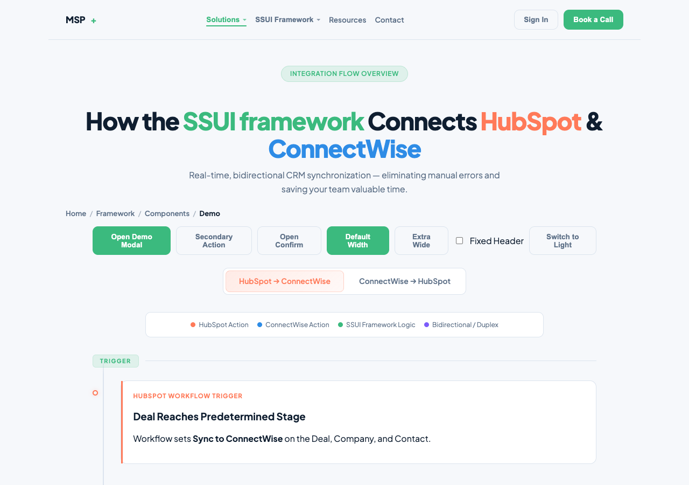
